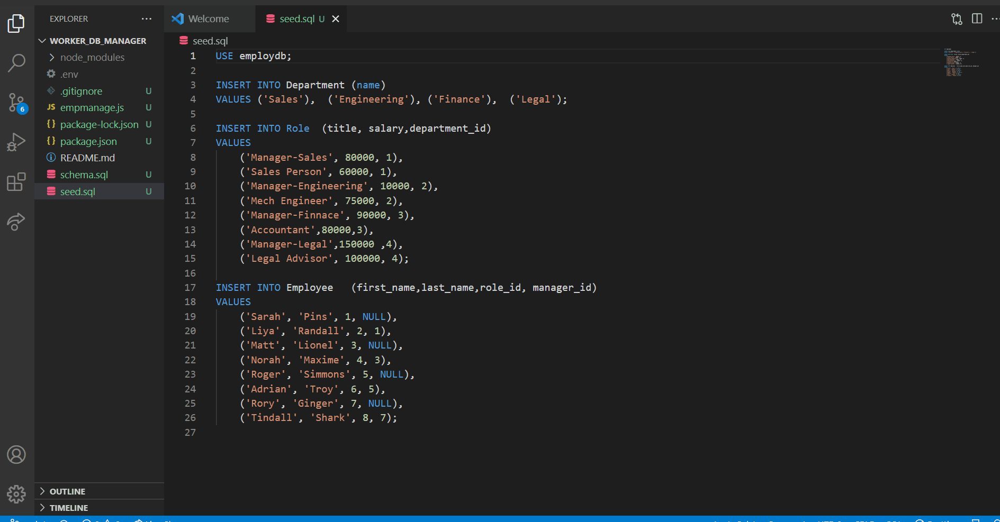

# worker_db_manager

* The features worked upon are  are 
*  View -departments table ,role table & employee table;
*  Add -department ,employee and role
*  Update emprole
* Installed& tested several npm packages - config.dotenv  ;  mysql2  -also used features  that are in in the ongoing sessions.

* Challenges :Had github issues in the last few days ;GH commands used and tested for past HWs did not work this time .Thanks to BCSLA.

     Visual 
 
